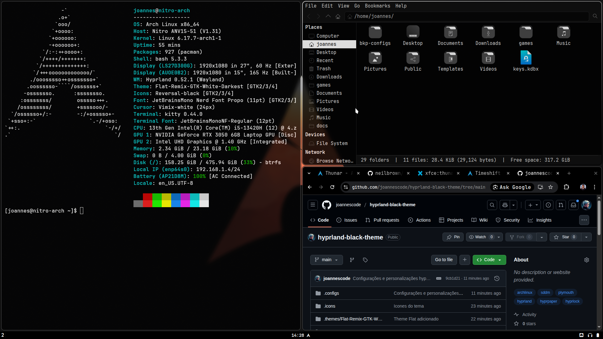

# Arch Linux + Hyprland Custom Setup

Este repositório contém minhas customizações pessoais do **Arch Linux** com **Hyprland**, voltadas para um ambiente minimalista, funcional e esteticamente consistente.

---

## Componentes Personalizados

- **Hyprland** → Gerenciador de janelas Wayland com regras e aparência ajustadas  
- **Kitty** → Terminal com tema minimalista e leve transparência  
- **Fuzzel** → Menu simples e rápido para opções de desligamento, reinício, bloqueio, etc  
- **Wofi** → Launcher de aplicativos com tema integrado ao sistema  
- **Hyprlock** → Tela de bloqueio personalizada para combinar com o visual do Hyprland  
- **Hyprpaper** → Gerenciador de wallpapers automático e leve  
- **Gammastep** → Ajuste de temperatura de cor da tela conforme o horário  
- **Tema e Cursor (Gnome-Look)** → Aplicados para manter consistência visual
- **Plymouth** → Gif de bootloader customizada
- **SDDM** → Gerenciador de autenticação personalizado

---

## Preview

